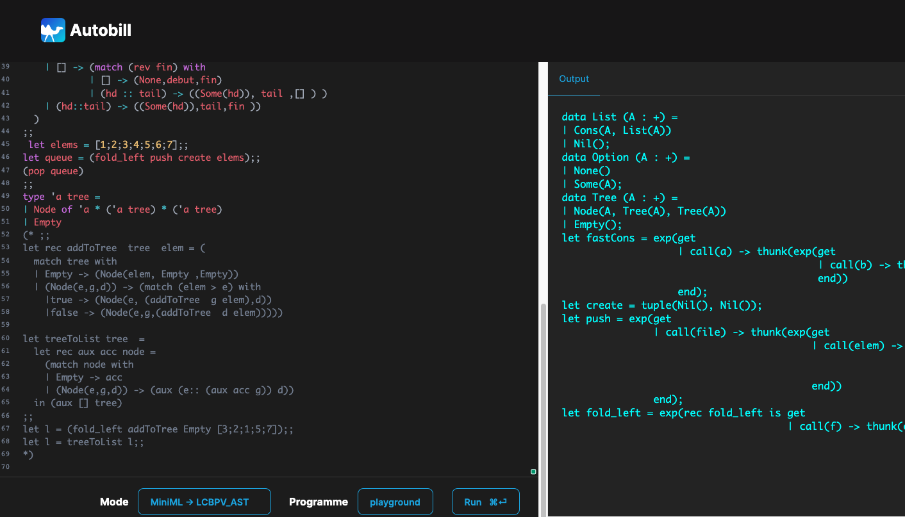

 <!--pandoc --lua-filter ./MarkdownVersions/color-text.lua  -N --variable "geometry=margin=1.2in" --variable mainfont="Palatino" --variable sansfont="Helvetica" --variable monofont="Menlo" --variable fontsize=12pt --variable version=2.0 ./MarkdownVersions/Rapport.md  --pdf-engine=xelatex --toc -o Rapport.pdf -->
\newpage

# Contexte du projet

## Qu-est-ce qu'est Autobill ?
  
  
## Comment on rentre dans ce projet ?
  Le sujet de notre Projet STL va donc être de soutenir l'effort de développement
  en proposant une interface sur le Web permettant la libre manipulation de l'outil. En effet, il n'est pour l'heure uniquement utilisable via l'invite de commandes, en ayant au préalabe cloner le repertoire GitLab où il est hébergé, et suivi les étapes d'installation, nécessitant des utilitaires de paquetes comme opam et dune.

  Notre approche vise donc à faciliter l'utilisation d'Autobill avec une interface Web qui prendrait la forme d'un "mini" environnement de développement, avec un 
  éditeur de code et une sortie standard sur le côté. Aussi, pour le rendre le plus accesibble, en entrée, un langage avec un syntaxe similaire à OcamL sera disponible en entrée et pourra être utilisé pour écrire les programmes à tester. Plusieurs modes d'évaluation seront disponibles, comme la possibilité d'interpréter ou d'afficher l'occupation mémoire minimum du programme en entrée.

  Néanmoins, le langage accepté d'Autobill étant Call-By-Push-Value, il est nécessaire de pouvoir traduire le langage camélien pour permettre l'évaluation des contraintes et de l'allocation mémoire du programme. Ainsi, un travail sur la compilation d'un langage à un autre va avoir lieu, passant par les étapes de construction d'AST camélien et par la traduction de ce dernier en un AST compréhensible par Autobill.

# Avancement
## MiniML
  - Description du language
  - Description traduction vers lcbpv
    - Expliquer lcbpv (Contexte,Fonctionnement,Difficultées)
  - Choix de Conception
  
## Archi Full Client
### Design du client

### Outils et Technologies utilisées
- **HTML / CSS / Javascript** : 
Il s'agit de la suite de langages principaux permettant de bâtir l'interface Web souhaitée. On a ainsi la main sur la structure de la page à l'aide des balises HTML, du style souhaitée pour l'éditeur de code avec le CSS et on vient apporter l'interactivité et les fonctionnalités en les programmant avec Javascript, complété par la librarie React.

- **React.js** : React s'ajoute par dessus la stack technique décrite plus haut pour proposer une expérience de programmation orientée composant sur le Web. C'est une librairie Javascript permettant de construire des applications web complexes tournant autour de composants / élements possèdant un état que l'on peut imbriquer entre eux pour former notre interface utilisateur et leur programmer des comportements et des fonctionnalités précises, sans se soucier de la manipulation du DOM de la page Web.

- **CodeMirror** : C'est une librairie Javascript permettant d'intégrer un éditeur de code puissant, incluant le support de la coloration syntaxique, de l'auto-complétion ou encore la surlignage d'erreurs. Les fonctionnalités de l'éditeur sont grandement extensives et permettant même  la compatibilité avec un langage de programmation personnalité comme MiniML. Enfin, CodeMirror est disponible sous licence MIT.

- **Js_of_ocaml** : 
### Tâches réalisées : 
  - Interlanguage Pb Rencontrée (Thread Block , Exception ... )

    - React : 
    - 
  - Description Js_Of_Ocaml 
    - Neccesaire dans l'archi full client (Pourquoi)
- Solveur (Web Assembly)

## Archi Serveur + Client
  - Design du server (Images ? Inspirations ?)
    -  Schema
        -  Montrer les echanges de données
    - Pourquoi Node ? (Et pas ocaml par exemple)
    - Tenter un lien PC3R ??
  - Solveur

# Projections (Rapport Suivant)
## MiniML
  - Description + Full Spec
  - Lazyness
  - Bibliothéque de tests (Structure de donéees complexes)

## Serveur
  - ?
  
## Client 
  - ?
  
## Tests
  - Comparaison Client vs Servers
  - Comparaison YAML vs Autobill

# Bibliographie 
  - Reprendre le carnet de bord
